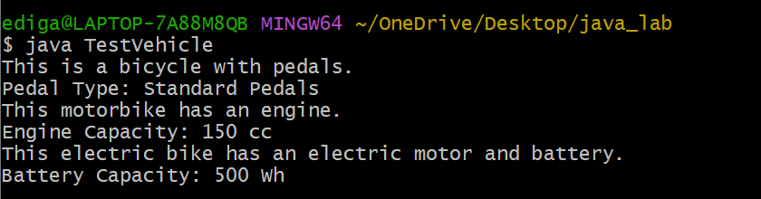

# EXPERIMENT-4
## 4.A. To impliment Single inheritance
## Source code:
``` java
public class Person {
    // Data members
    String name;
    int age;
 // Constructor
    public Person(String name, int age) {
        this.name = name;
        this.age = age;
    }
    // Method to display person details
    public void displayPersonDetails() {
        System.out.println("Name : " + name);
        System.out.println("Age  : " + age);
    }
}
public class Employee extends Person {
    // Data members
    double annualSalary;
    int yearOfJoining;
    String nationalInsuranceNumber;
  // Constructor
    public Employee(String name, int age, double annualSalary, int yearOfJoining, String nationalInsuranceNumber) {
        // Call base class constructor
        super(name, age);
        this.annualSalary = annualSalary;
        this.yearOfJoining = yearOfJoining;
        this.nationalInsuranceNumber = nationalInsuranceNumber;
    }
    // Method to display employee details
    public void displayEmployeeDetails() {
        // Display Person details
        displayPersonDetails();
        // Display Employee details
        System.out.println("Annual Salary : " + annualSalary);
        System.out.println("Year of Joining : " + yearOfJoining);
        System.out.println("National Insurance Number : " + nationalInsuranceNumber);
    }
}
public class TestEmployee {
    public static void main(String[] args) {
        // Create Employee object
        Employee emp1 = new Employee(
                "Rahul Sharma",
                28,
                550000.00,
                2022,
                "NI12345A"
        );
        // Display employee details
        emp1.displayEmployeeDetails();
    }
}
```
# output:

